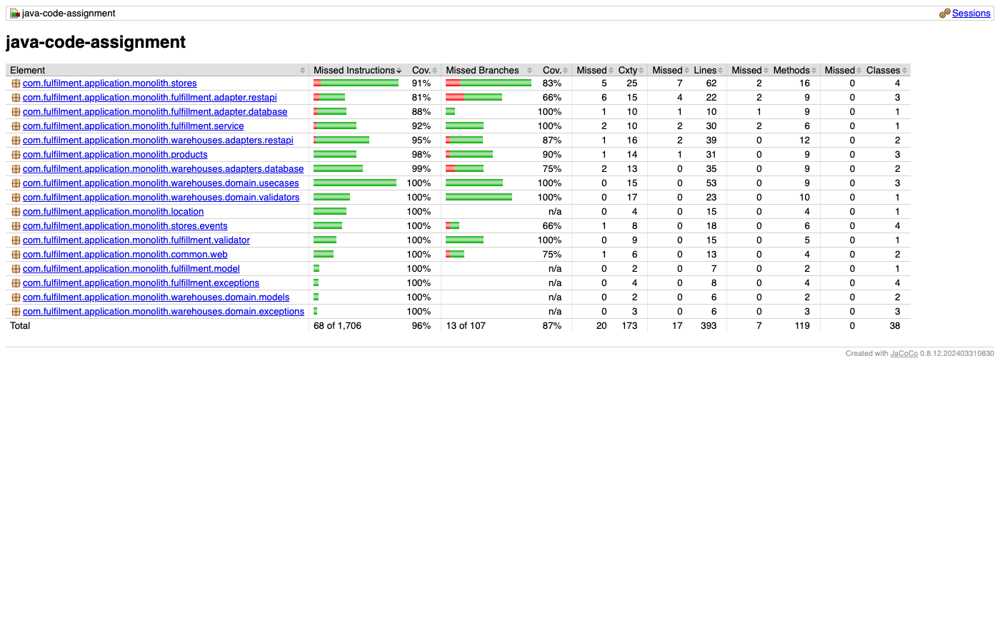
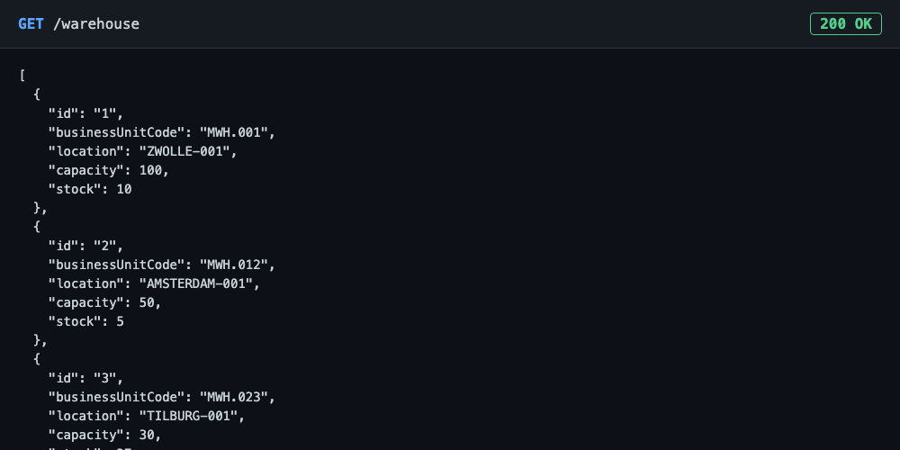
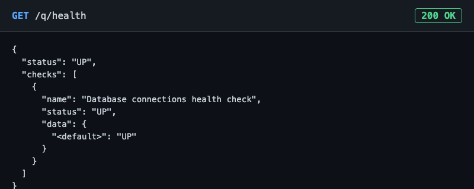
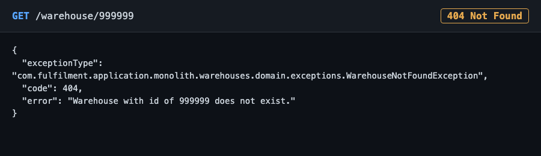

# Java Code Assignment

A small Quarkus REST service for a simplified warehouse colocation management system. It manages
`Location`, `Store`, `Product` and `Warehouse` records, and associates warehouses with products and
stores as fulfillment units. See [`../case-study/BRIEFING.md`](../case-study/BRIEFING.md) for the
domain background, [`CODE_ASSIGNMENT.md`](CODE_ASSIGNMENT.md) for the original task list, and
[`QUESTIONS.md`](QUESTIONS.md) for written answers on the design decisions taken.

This project is based on the [Quarkus quickstarts](https://github.com/quarkusio/quarkus-quickstarts)
Hibernate ORM with Panache example.

## Contents

- [Prerequisites](#prerequisites)
- [Building and running](#building-and-running)
- [Testing and coverage](#testing-and-coverage)
- [API overview](#api-overview)
- [Project structure](#project-structure)
- [Screenshots](#screenshots)
- [Local environment notes](#local-environment-notes)

## Prerequisites

- JDK 17 or newer, with `JAVA_HOME` pointing at it.
- Either a local PostgreSQL instance, or Docker (Quarkus Dev Services will start and manage a
  disposable Postgres container automatically for `dev` and `test` mode when Docker is available).

## Building and running

```sh
cd java-assignment

# Build
./mvnw package

# Dev mode: live reload, auto-starts Postgres via Dev Services
./mvnw quarkus:dev
```

To run the packaged jar against a manually started database instead:

```sh
docker run -it --rm --name quarkus_test \
  -e POSTGRES_USER=quarkus_test -e POSTGRES_PASSWORD=quarkus_test -e POSTGRES_DB=quarkus_test \
  -p 15432:5432 postgres:13.3

java -jar target/quarkus-app/quarkus-run.jar
```

Connection settings for the `%prod` profile live in `src/main/resources/application.properties`.
Once running, a quick sanity check:

```sh
curl http://localhost:8080/q/health
curl http://localhost:8080/warehouse
```

## Testing and coverage

```sh
./mvnw test      # run all tests
./mvnw verify    # run all tests AND enforce the coverage gate below
```

The project has 103 JUnit tests covering positive, negative and error paths across every
implemented feature. `jacoco-maven-plugin` is wired into the `verify` phase and fails the build if
instruction or line coverage drops below **80%**; current coverage sits at roughly **96%**
instructions / **96%** lines. The OpenAPI-generated `com.warehouse.api` package is excluded from
the count, since it's generated code rather than hand-written.

After running `./mvnw verify`, open `target/site/jacoco/index.html` for the full per-package
breakdown (see the [screenshot](#screenshots) below for what that looks like).

A GitHub Actions workflow (`.github/workflows/ci.yml`) runs `./mvnw -B verify` on every push and
pull request, publishes a coverage summary to the run's job summary, and uploads the JaCoCo HTML
report and Surefire test reports as downloadable build artifacts, so coverage stays visible and
trackable over time rather than only checked locally.

## API overview

| Resource | Base path | Notes |
|---|---|---|
| Store | `/store` | Full CRUD. Changes are mirrored to a legacy system only after the database transaction commits. |
| Product | `/product` | Full CRUD. |
| Warehouse | `/warehouse` | List, get by id, create, archive, and a `/warehouse/{businessUnitCode}/replacement` endpoint that archives the current warehouse for that code and creates a new one in its place. Contract defined by `src/main/resources/openapi/warehouse-openapi.yaml`. |
| Fulfillment | `/fulfillment` | Bonus feature: associates a warehouse with a product and a store, enforcing the three cardinality rules described below. |
| Health | `/q/health` | Liveness/readiness, including a database connectivity check. |

The `Location` domain has no REST surface; it's resolved internally when creating or replacing a
warehouse.

**Fulfillment rules** (`FulfillmentValidator`): a product may be fulfilled by at most 2 warehouses
per store, a store may be fulfilled by at most 3 warehouses in total, and a warehouse may hold at
most 5 distinct product types.

## Project structure

The codebase separates business rules from persistence and transport concerns, most consistently
in the `warehouses` and `fulfillment` packages:

- `location/` — resolves a `Location` by identifier from a small static reference list.
- `products/`, `stores/` — straightforward CRUD entities and resources, plus `stores/events/`,
  which holds the CDI event and listener that defer the legacy-system sync until after a Store's
  database transaction has actually committed.
- `warehouses/domain/` — framework-free business logic: `models/` (the domain `Warehouse` and
  `Location`, independent of the JPA entity), `ports/` (interfaces the use cases depend on),
  `usecases/` (create/replace/archive orchestration), `validators/` (the feasibility rules shared
  by create and replace), and `exceptions/` (domain-level errors, mapped to HTTP status codes by
  the adapter layer).
- `warehouses/adapters/` — the two things that talk to the outside world: `database/` (the JPA
  entity and Panache repository) and `restapi/` (the OpenAPI-generated resource implementation and
  its exception mapper).
- `fulfillment/` — the bonus feature, organized the same way: `model/` (the entity), `adapter/`
  (`database/` for the repository, `restapi/` for the resource, request DTO and exception mapper),
  `validator/` (the three cardinality rules), `service/` (orchestration: existence checks, then
  delegating to the validator, then persisting), and `exceptions/`.
- `common/web/` — the shared JSON error-response shape and generic exception mapper used by every
  resource in the project.

## Screenshots

**Test coverage report** (`target/site/jacoco/index.html`), showing the per-package breakdown
after the structural reorganization above:



**`GET /warehouse`**, listing the seeded warehouses:



**`GET /q/health`**, confirming the app and its database connection are up:



**`GET /warehouse/{id}` for an id that doesn't exist**, showing the consistent error JSON shape
every resource in the project returns:



## Local environment notes

Two environment quirks were hit while developing this on macOS, neither of which are code issues,
and neither of which should affect the CI workflow above (it runs on a plain `ubuntu-latest`
runner):

- **Wrong JDK picked up.** If `JAVA_HOME` isn't set, some systems resolve a different JDK than the
  one on `PATH` when Maven's wrapper looks one up. A `Byte Buddy` or other bytecode-version error
  during test augmentation means the wrong JDK is active; export `JAVA_HOME` to a JDK 17 install
  before running `./mvnw`.
- **Docker Desktop / Testcontainers version mismatch.** If Quarkus Dev Services fails to start
  Postgres with `Previous attempts to find a Docker environment failed`, even though `docker info`
  works fine from the shell, it's usually a version mismatch between the bundled Testcontainers
  client and a newer Docker Desktop release. Workaround: start Postgres manually and point the
  build at it directly, bypassing Dev Services:

  ```sh
  docker run -d --name pg_test -e POSTGRES_USER=quarkus_test -e POSTGRES_PASSWORD=quarkus_test \
    -e POSTGRES_DB=quarkus_test -p 15432:5432 postgres:13.3

  ./mvnw verify \
    -Dquarkus.datasource.db-kind=postgresql \
    -Dquarkus.datasource.username=quarkus_test \
    -Dquarkus.datasource.password=quarkus_test \
    -Dquarkus.datasource.jdbc.url=jdbc:postgresql://localhost:15432/quarkus_test
  ```

  This doesn't require any change to the committed `application.properties`.